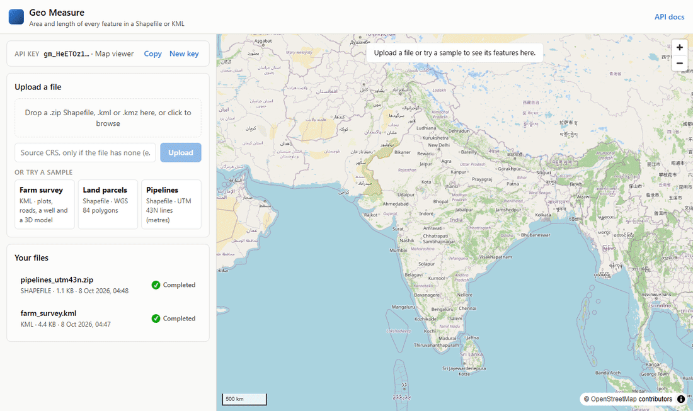
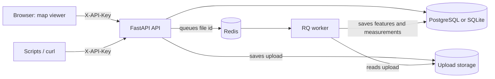

# Geospatial File Measurement API

[](https://github.com/stackDawg/aereo-geosurvey-api/actions/workflows/ci.yml)

Upload a Shapefile or a KML file and get back the area of every polygon and the length of every
line, in metres. It's built with FastAPI, and a small React map viewer sits on top so you can see
the results.

**Live demo:** LIVE_DEMO_URL (map viewer) · LIVE_DEMO_URL/docs (API docs)
<br>The demo runs on a free server that sleeps when idle, so the first request can take about a
minute.



## Why I picked this assignment

During my internship at Skylark Drones I built the data layer for tracking construction progress
on utility-scale solar plants. Shapefile layouts and field reports came from sites in two
different UTM zones (42N and 43N) and had to end up in one store that could be queried. The
lesson that stuck: when coordinate systems are handled loosely, nothing crashes. The numbers are
just quietly wrong. This assignment is about getting exactly that right, so I chose it.

## What it does

- **Accepts** a zipped Shapefile (`.zip`), a `.kml`, or a `.kmz`. A zip can hold several
  shapefiles, even in sub-folders; each one becomes a layer.
- **Records, for every feature:**
  - its index and the ID it had in the file;
  - its layer and geometry type;
  - the geometry itself, as GeoJSON;
  - its CRS;
  - its attributes, including the KML `ExtendedData` that many tools drop.
- **Measures** polygons (area and perimeter) and lines (length). Points have nothing to measure,
  and multi-part shapes are summed.
- **Never measures in degrees.** Each feature is projected into a metric coordinate system that
  suits where it is on Earth (see [CRS handling](#crs-handling)).
- **Doesn't let one bad feature sink the file.** A 3D model, an empty shape, a self-intersecting
  polygon or a missing `.prj` is reported on that feature, and the rest of the file is processed
  normally.

Around that core:
- **API keys:** each user only sees their own files.
- **Background processing:** a Redis worker, or the API process itself when Redis isn't set up.
- **Storage:** PostgreSQL or SQLite.
- **Tooling:** a Docker Compose setup and CI.

## Contents

- [Running it](#running-it)
- [Using the API](#using-the-api)
- [The map viewer](#the-map-viewer)
- [How it works](#how-it-works)
- [Design decisions](#design-decisions)
- [Known limitations](#known-limitations)
- [What I learned](#what-i-learned)
- [What I'd do next](#what-id-do-next)

---

## Running it

### With Docker Compose (everything)

```bash
docker compose up --build
```

This starts the API, the map viewer, a background worker, PostgreSQL and Redis. Open
<http://localhost:8000> for the viewer and <http://localhost:8000/docs> for the API docs.

### Without Docker (just Python)

You need Python 3.11 or newer. You don't need to install GDAL or PROJ yourself: the Python
packages ship with them.

```bash
python -m venv .venv
source .venv/bin/activate          # Windows: .venv\Scripts\activate
pip install -e ".[dev]"
uvicorn app.main:app --reload
```

- **Database:** SQLite, in `./data/`.
- **Processing:** files are processed inside the API process, so you don't need Redis.
- **The viewer:** to have the API serve it at `/`, build it once (Node 20+):

  ```bash
  cd frontend && npm ci && npm run build
  ```

  While working on the viewer, `npm run dev` serves it with hot reload on
  <http://localhost:5173> and forwards API calls to port 8000.

To use a real background worker instead, set `GEOAPI_REDIS_URL` and run
`rq worker --url "$GEOAPI_REDIS_URL" geo-processing`. RQ workers don't run on Windows; use
Docker Compose there.

### Running the tests

```bash
pytest                                   # ~120 tests on SQLite, with Redis faked
ruff check . && ruff format --check .
python scripts/smoke_test.py --base-url http://localhost:8000   # against a running server
```

CI ([`.github/workflows/ci.yml`](.github/workflows/ci.yml)) covers what a laptop usually doesn't:
- the tests on Python 3.11, 3.12 and 3.13;
- the tests again on real PostgreSQL and Redis, including a real worker;
- a type check and build of the viewer;
- a full `docker compose up` followed by the smoke test, which uploads sample files over HTTP and
  checks the results.

### Configuration

Settings come from environment variables or a `.env` file (see [`.env.example`](.env.example)).

| Variable | Default | What it does |
|---|---|---|
| `GEOAPI_DATABASE_URL` | `sqlite:///./data/geoapi.db` | Any SQLAlchemy URL, e.g. `postgresql+psycopg://…` |
| `GEOAPI_STORAGE_DIR` | `./data/uploads` | Where uploaded files are kept; workers need the same folder |
| `GEOAPI_REDIS_URL` | *(not set)* | Set it to process files in RQ workers |
| `GEOAPI_QUEUE_NAME` | `geo-processing` | RQ queue name |
| `GEOAPI_ALLOW_KEY_SIGNUP` | `true` | Let anyone create an API key |
| `GEOAPI_MAX_UPLOAD_SIZE_MB` | `100` | Largest upload accepted |
| `GEOAPI_MAX_EXTRACTED_SIZE_MB` | `500` | Largest a `.zip`/`.kmz` may be once unpacked |
| `GEOAPI_MAX_ARCHIVE_MEMBERS` | `1000` | Most files a `.zip`/`.kmz` may contain |
| `GEOAPI_MEASUREMENT_CRS_STRATEGY` | `utm` | `utm` or `laea` (see [CRS handling](#crs-handling)) |
| `GEOAPI_FRONTEND_DIR` | `./frontend/dist` | Where the built viewer is |
| `GEOAPI_LOG_LEVEL` | `INFO` | Log level |

With sign-up turned off, an admin creates keys with `python -m app.cli create-key "Team name"`.

### Deploying the demo

[`render.yaml`](render.yaml) deploys the Docker image to Render's free plan as a single service:
SQLite, and processing inside the API. On Render, choose *New → Blueprint* and pick this
repository. The free plan has no permanent disk, so the demo forgets its data when it restarts;
the viewer just creates a new key. The same image also runs on Railway or Fly.io, because it
listens on whatever `$PORT` the platform gives it.

### Sample files

They're in [`samples/`](samples), and the viewer can upload them with one click. Rebuild the
Shapefiles with `python scripts/make_samples.py`.

| File | What's in it |
|---|---|
| `farm_survey.kml` | Four plots (one with a pond cut out, one in two parts, one with a boundary that crosses itself), two roads, a borewell, and a 3D model |
| `parcels_wgs84.zip` | Land parcels as a Shapefile in latitude/longitude (EPSG:4326) |
| `pipelines_utm43n.zip` | Pipelines as a Shapefile already in metres (UTM zone 43N, EPSG:32643) |
| `pipelines_no_prj.zip` | The same pipelines with the `.prj` missing, to show the `source_crs` option |

---

## Using the API

The flow has four steps: get a key, upload a file, wait for it to finish, then read the results.
Every request below sends the key in an `X-API-Key` header.

### 1. Get an API key

```bash
curl -X POST http://localhost:8000/api/auth/keys/ \
  -H "Content-Type: application/json" -d '{"name": "Survey team"}'
```
```json
{
  "id": "0a844adc4b8f40fca7cb6c978111ba17",
  "name": "Survey team",
  "key_prefix": "gm_AlKVnPF",
  "created_at": "2026-10-07T23:20:57.620221Z",
  "api_key": "gm_AlKVnPF…(shown only once)"
}
```

```bash
export GEOAPI_KEY=gm_...   # the api_key from the response
```

The key is shown once, so keep it. Files belong to the key that uploaded them. Any other key gets
a `404` for them, not a `403`, so it can't even tell that the file exists. In the API docs at
`/docs`, click **Authorize** and paste the key to try requests there.

### 2. Upload a file

```bash
curl -i -X POST http://localhost:8000/api/files/ \
  -H "X-API-Key: $GEOAPI_KEY" -F "file=@samples/farm_survey.kml"
```

```http
HTTP/1.1 202 Accepted
location: /api/files/b57e68341afc46ecb98ee26bcf6fd3f0/
```
```json
{
  "id": "b57e68341afc46ecb98ee26bcf6fd3f0",
  "filename": "farm_survey.kml",
  "status": "PENDING",
  "feature_count": null
}
```

(Trimmed. The full response has the same fields as in step 3, most of them still empty.)

The upload is checked straight away. A file that is clearly broken is rejected with an error
right then; the checks are listed under step 1 of
[What happens to an uploaded file](#what-happens-to-an-uploaded-file). Reading and measuring the
features happens afterwards, in the background. That's why the response is `202 Accepted` with
status `PENDING`.

If the file doesn't say which coordinate system it uses, typically a Shapefile without its `.prj`,
tell the API with `source_crs`. Any form pyproj understands works: `EPSG:32643`, WKT, or a PROJ
string.

```bash
curl -X POST http://localhost:8000/api/files/ -H "X-API-Key: $GEOAPI_KEY" \
  -F "file=@samples/pipelines_no_prj.zip" -F "source_crs=EPSG:32643"
```

### 3. Wait for it to finish: `GET /api/files/{id}/`

```json
{
  "id": "b57e68341afc46ecb98ee26bcf6fd3f0",
  "filename": "farm_survey.kml",
  "file_type": "KML",
  "size_bytes": 4482,
  "status": "COMPLETED",
  "crs": "EPSG:4326",
  "source_crs": null,
  "feature_count": 8,
  "layers": [
    { "name": "Hosakote farm survey/Plots", "crs": "EPSG:4326", "feature_count": 4 },
    { "name": "Hosakote farm survey/Access roads", "crs": "EPSG:4326", "feature_count": 2 },
    { "name": "Hosakote farm survey/Assets", "crs": "EPSG:4326", "feature_count": 2 }
  ],
  "warnings": [],
  "error": null,
  "created_at": "2026-10-07T22:27:39.486047Z",
  "processed_at": "2026-10-07T22:27:39.508288Z"
}
```

- `status` goes from `PENDING` to `PROCESSING`, then to `COMPLETED` or `FAILED` (in which case
  `error` says why). Small files finish in well under a second.
- `crs` is `null` when it's unknown, or when the layers use different coordinate systems; each
  layer's own CRS is listed under `layers`.
- `warnings` lists things worth knowing that didn't stop processing, such as a missing `.prj`.

### 4. Read the measurements: `GET /api/files/{id}/measurements/`

`summary` covers the whole file; `items` lists features page by page (`limit`, default 1000, and
`offset`). Two of the eight items are shown here: the plot whose boundary crosses itself, and the
3D model that can't be measured.

```json
{
  "total": 8,
  "limit": 1000,
  "offset": 0,
  "file_id": "b57e68341afc46ecb98ee26bcf6fd3f0",
  "summary": {
    "feature_count": 8,
    "measured_count": 6,
    "total_area_m2": 78103.877,
    "total_length_m": 775.836,
    "by_status": { "MEASURED": 6, "NOT_APPLICABLE": 1, "UNSUPPORTED": 1 },
    "by_geometry_type": { "LineString": 2, "Model": 1, "MultiPolygon": 1, "Point": 1, "Polygon": 3 }
  },
  "items": [
    {
      "feature_index": 3,
      "feature_id": "plot-104",
      "layer": "Hosakote farm survey/Plots",
      "geometry_type": "Polygon",
      "status": "MEASURED",
      "area_m2": 6007.981,
      "perimeter_m": 531.5,
      "length_m": null,
      "measurement_crs": "EPSG:32643",
      "message": "Invalid polygon geometry (Self-intersection) was repaired before measuring."
    },
    {
      "feature_index": 7,
      "feature_id": "shed-1",
      "layer": "Hosakote farm survey/Assets",
      "geometry_type": "Model",
      "status": "UNSUPPORTED",
      "area_m2": null,
      "perimeter_m": null,
      "length_m": null,
      "measurement_crs": null,
      "message": "3D Model geometries cannot be measured."
    }
  ]
}
```

Units are in the field names: `area_m2` is square metres, and `perimeter_m` and `length_m` are
metres. `measurement_crs` tells you exactly which projection a number came from, so you can
check it yourself in any GIS.

Every feature gets one of these statuses:

| `status` | Meaning |
|---|---|
| `MEASURED` | Area and perimeter (polygons) and/or length (lines) were calculated |
| `NOT_APPLICABLE` | A point: there's nothing to measure |
| `UNSUPPORTED` | A shape that can't be measured, like a KML 3D `<Model>` |
| `NO_GEOMETRY` | The feature has no shape at all (e.g. an empty Shapefile record) |
| `FAILED` | It should be measurable, but something was wrong, e.g. the CRS is unknown or the coordinates don't fit it. `message` explains |

### 5. Get the features themselves: `GET /api/files/{id}/features/`

This returns each feature's geometry as GeoJSON, its attributes, and its measurement. Geometry
comes back in the feature's own coordinate system. Add `?crs=EPSG:4326` to have it converted to
latitude/longitude for a web map; that's what the viewer does.

```json
{
  "total": 8,
  "limit": 1,
  "offset": 1,
  "items": [
    {
      "feature_index": 1,
      "feature_id": "plot-102",
      "layer": "Hosakote farm survey/Plots",
      "geometry_type": "Polygon",
      "crs": "EPSG:4326",
      "geometry": {
        "type": "Polygon",
        "coordinates": [
          [[77.7917, 13.07, 0.0], [77.7935, 13.07, 0.0], [77.7935, 13.0714, 0.0], [77.7917, 13.0714, 0.0], [77.7917, 13.07, 0.0]],
          [[77.7922, 13.0704, 0.0], [77.7926, 13.0704, 0.0], [77.7926, 13.0707, 0.0], [77.7922, 13.0707, 0.0], [77.7922, 13.0704, 0.0]]
        ]
      },
      "properties": {
        "name": "Plot 102",
        "description": "Sugarcane, with a farm pond excluded from the cultivated area.",
        "owner": "S. Lakshmi",
        "survey_no": 102,
        "crop": "sugarcane",
        "irrigated": true
      },
      "measurement": {
        "status": "MEASURED",
        "area_m2": 28838.448,
        "perimeter_m": 853.97,
        "length_m": null,
        "measurement_crs": "EPSG:32643",
        "message": null
      }
    }
  ]
}
```

The second ring in `coordinates` is the farm pond. It's a hole, so its area isn't counted.

### All endpoints

| Method | Path | What it does |
|---|---|---|
| `POST` | `/api/auth/keys/` | Create an API key (`{"name": "..."}`) |
| `GET` | `/api/auth/me/` | Show who the current key belongs to |
| `POST` | `/api/files/` | Upload a file (form fields: `file`, optional `source_crs`) |
| `GET` | `/api/files/` | List your files, newest first (`limit`, `offset`) |
| `GET` | `/api/files/{id}/` | A file's status and details |
| `GET` | `/api/files/{id}/measurements/` | Measurements per feature, plus totals |
| `GET` | `/api/files/{id}/features/` | Features with geometry and attributes (`crs` to convert) |
| `DELETE` | `/api/files/{id}/` | Delete a file and its results |
| `GET` | `/health` | Is the service up? |

Paths end with a slash. Without it you get a `307` redirect, so use `curl -L` or add the slash.

### Errors

Errors always look like `{"detail": "a readable message"}`.

| Status | When |
|---|---|
| `401` | The `X-API-Key` header is missing or wrong |
| `403` | You tried to create a key, but sign-up is turned off |
| `404` | No such file, or it belongs to someone else |
| `409` | You asked for results before the file finished, the file failed, or you tried to delete a file that's still processing |
| `413` | The file is over the size limit |
| `415` | The file isn't a `.zip`, `.kml` or `.kmz` |
| `422` | The file is corrupt or incomplete (e.g. `'parcels.shp' is missing .dbf`), or a CRS you passed isn't valid |
| `503` | Redis is down, so the file couldn't be queued. It's marked `FAILED` rather than left hanging |

---

## The map viewer

The viewer in [`frontend/`](frontend) is React and TypeScript, built with Vite, with MapLibre GL
for the map. The API serves it at `/`, so there's only one thing to deploy.

- **Getting started:** on your first visit it creates an API key for you and keeps it in the
  browser. If that key stops working (say the demo server restarted), it makes a new one. Drag a
  file in, or press **Try a sample**.
- **Watching progress:** the file list refreshes until processing is done.
- **The map:**
  - Polygons are shaded from light to dark blue by area, with a legend.
  - Lines are orange, points are grey dots, and anything that couldn't be measured is grey.
  - Hovering shows a feature's name and size; clicking shows all its details and attributes.
- **The feature table:** lists everything in the file. Clicking a row zooms the map to that
  feature.
- **Accessibility:** status is always an icon plus a word, never just a colour; table rows work
  with the keyboard; the viewer follows your system's light or dark mode and stacks vertically on
  a phone.

---

## How it works

### The big picture



The API checks and stores uploads and answers queries. The worker does the heavy lifting: reading
files and measuring features. With no Redis configured, the worker and Redis drop out of the
picture, and the API runs exactly the same processing code itself after replying. That's how
local development, the tests and the free demo run.

### Code layout

```
app/
├── main.py              Builds the app: wiring, startup, error handling, serving the viewer
├── config.py            Settings (GEOAPI_* environment variables)
├── database.py          Database engine and sessions; SQLite tuning
├── models.py            Tables: ApiClient 1──* GeoFile (an upload) 1──* Feature (+ its measurement)
├── schemas.py           Request and response shapes
├── errors.py            Errors and the HTTP status each one maps to
├── worker.py            What an RQ worker runs
├── cli.py               `python -m app.cli create-key NAME`
├── api/                 HTTP routes, kept thin
│   ├── deps.py          Shared dependencies: database session, settings, current API key
│   ├── auth.py          /api/auth
│   └── files.py         /api/files
├── services/            The application logic
│   ├── auth.py          Creating and checking API keys
│   ├── files.py         Storing uploads and querying results (always per owner)
│   ├── tasks.py         Deciding how processing runs: in the API or on a worker
│   └── processing.py    Read the file → measure each feature → save
└── geo/                 Pure geospatial code: knows nothing about HTTP or databases
    ├── types.py         FileType, SourceFeature
    ├── crs.py           Coordinate systems: parsing, converting, choosing a projection
    ├── measure.py       Area, perimeter and length of one shape
    └── readers/
        ├── base.py      The reader interface, plus safe zip handling
        ├── shapefile.py Shapefile reader (GDAL, via pyogrio)
        └── kml.py       KML/KMZ reader (defusedxml)
frontend/                The map viewer
tests/                   Tests for each module, the API, auth, the queue and the viewer
samples/                 Example files
scripts/                 make_samples.py, smoke_test.py
```

Code only depends downwards: routes → services → geo. Because `geo/` knows nothing about the web
or the database, it's tested directly, and the same code runs in the API or in a worker.
Supporting a new format such as GeoJSON or GeoPackage means writing one new reader class.

### What happens to an uploaded file

1. **Quick checks, while you wait.** These are cheap, so they run before the response:
   - the extension and the size limit;
   - for a zip: that it opens, stays within the archive limits, and that every `.shp` has its
     `.shx` and `.dbf`;
   - for a KML: that the document really starts with `<kml>`.

   If any check fails, you get an error and nothing is kept.
2. **Save and queue.** The file is stored, a database row is created with status `PENDING`, and
   processing is handed off: to a Redis queue if one is configured, otherwise to a background
   task in the API process. The route doesn't know which; that's decided once, from
   configuration.
3. **Read the features, one at a time.**
   - **Shapefile reader:** groups the zip's files into shapefiles, ignoring the `__MACOSX` clutter
     that Macs add. It unpacks them into a temporary folder under names it chooses itself, never
     the names from the archive, then reads them with GDAL in batches of 1,000.
   - **KML reader:** walks the document's folders (which become layer names) and reads each
     `Placemark`.
4. **Measure each feature and save in batches.** If one feature has a problem, it gets a status
   and a message, and processing continues. Only a problem with the file as a whole (corrupt XML,
   an unreadable `.shp`) marks the file `FAILED`.
5. **Finish all at once.** Every feature is saved in one database transaction that ends by
   setting `COMPLETED`. If anything goes wrong midway, the whole transaction is rolled back, so you
   never see a half-processed file. Processing a file again starts by clearing its old results,
   so it's safe to repeat.

### How a feature is measured

This is `measure_geometry()` in [`app/geo/measure.py`](app/geo/measure.py):

1. **No shape?** The status is `NO_GEOMETRY`.
2. **Break it into parts.** Multi-part shapes and mixed collections are split into simple
   polygons, lines and points. A type that isn't one of those is `UNSUPPORTED`. If only points
   are left, it's `NOT_APPLICABLE`.
3. **Know the CRS?** If not, the status is `FAILED`, with a hint to pass `source_crs`.
4. **Find where it is.** The coordinates are converted to latitude/longitude. If they come out
   impossible (beyond ±90° latitude or ±180° longitude), the file's CRS doesn't match its data
   and the status is `FAILED`. The usual cause is a `.prj` that says "degrees" on data that's
   actually in metres.
5. **Project it** into a metric CRS chosen for that location (next section). Heights are
   ignored, because area and length are measured on the map plane.
6. **Measure:**
   - **Polygons:** if a polygon is broken, say its boundary crosses itself or two parts overlap,
     it's repaired first and a note is added. Then area and perimeter are calculated; the
     perimeter includes the edges of any holes. Without the repair, a figure-of-eight boundary
     can come out with an area of zero.
   - **Lines:** their lengths are added up.
7. **Round** to the millimetre and record which CRS was used.

### CRS handling

This is the heart of the assignment, and the easiest part to get quietly wrong.

**The problem.** Latitude and longitude are angles, not distances. A degree of longitude is about
111 km at the equator and shrinks to nothing at the poles. So "area in square degrees" means
nothing. Each shape has to be projected onto a flat, metric grid before it's measured.

**Finding the source CRS.**
- **Shapefile:** GDAL reads it from the `.prj`, and pyproj turns it into a standard code. For
  example, the ESRI-style text for UTM zone 43N becomes `EPSG:32643`.
- **No `.prj`:** the service doesn't guess. It asks you for `source_crs`.
- **KML/KMZ:** the KML standard says coordinates are always WGS 84 latitude/longitude, so they're
  `EPSG:4326`.

**The axis-order trap.** Officially, EPSG:4326 lists latitude first. Shapefiles and KML store
longitude first. Mix those up and every shape lands in the wrong place without any error. Every
coordinate conversion here uses pyproj's `always_xy=True`, and a test checks that a point in
Bengaluru ends up where it should.

**Choosing the projection, per feature.** Each feature gets its own projection, because one file
can cover several UTM zones.

- **Default (`utm`):** use the UTM zone the feature sits in (EPSG:326xx north of the equator,
  327xx south). It's the standard choice for survey data, and its EPSG code is something any GIS
  user can check.
  - UTM is most accurate along the centre line of each zone and stretches a little towards the
    edges. Its scale is 0.9996 at the centre line, so a shape there measures about 0.08 % small.
  - The service only uses UTM when the whole feature lies within 3.5° of that centre line. That
    keeps the area error between about −0.08 % and +0.3 %.
- **Fallback (`laea`):** a Lambert azimuthal equal-area projection, centred on the feature. It
  covers two cases:
  - features near the poles, where UTM isn't defined;
  - features too wide for one zone.

  "Equal-area" means areas come out exactly right anywhere on Earth. Lengths drift a little the
  further you go from the centre, but by less than 0.01 % within 150 km.

  You can make it the only strategy with `GEOAPI_MEASUREMENT_CRS_STRATEGY=laea`.

**How accurate is it?** I compared the results with geodesic areas, calculated directly on the
Earth's ellipsoid with `pyproj.Geod`. That calculation needs no projection, so it serves as ground
truth. These comparisons run as tests in [`tests/test_measure.py`](tests/test_measure.py).

| Where | Feature | UTM zone chosen | Error with `utm` | Error with `laea` |
|---|---|---|---|---|
| Bengaluru, 13°N (2.6° from the zone's centre line) | ~1 km plot | EPSG:32643 | +0.116 % | <0.00001 % |
| Bengaluru | ~50 km region | EPSG:32643 | +0.155 % | −0.0009 % |
| Equator (1.5° from the centre line) | ~1 km plot | EPSG:32632 | −0.011 % | <0.00001 % |
| New York, 41°N | ~1 km plot | EPSG:32618 | −0.062 % | <0.00001 % |
| Tromsø, 70°N | ~1 km plot | EPSG:32634 | −0.064 % | <0.00001 % |
| Svalbard, 85°N (outside UTM) | ~1 km plot | uses `laea` | <0.00001 % | <0.00001 % |

For comparison, the same 1 km plot measured naively in degrees has an "area" of 0.0001. The tiny
`laea` difference on the 50 km region comes from the shape's edges: the ground truth follows the
curve of the Earth between corners, while a projected shape has straight edges.

**Data that's already projected gets re-projected too.** You might expect a file already in
metres to be measured as-is, but "projected" doesn't mean "good for measuring". Web Mercator
(EPSG:3857), the projection behind most web maps, inflates areas about 4× at 60°N. So every
feature goes through the same strategy, and a test checks that a Web Mercator file still gets the
true area. Units come from the CRS itself, so a file in US survey feet is measured correctly in
metres too. When a file is already in the right UTM zone, the conversion changes nothing.

**Edge cases handled:**
- **Shapes crossing the 180° line:** their longitudes are unwrapped before a zone is picked.
- **Polar shapes:** use the `laea` fallback.
- **KML altitudes:** ignored.
- **A `.prj` that can't be understood:** reported as a warning and treated as unknown.

---

## Design decisions

Each choice below comes with what I gave up and what I considered instead.

**FastAPI rather than Django.** This is a small API with no admin pages or HTML templates, which
is where Django pays for its size. FastAPI gave me typed request and response models, generated
API docs, and dependency injection. That last one made it easy to swap the processing backend
and the current user in tests. The cost: things Django includes, like database migrations, I'd
have to add myself (see [What I'd do next](#what-id-do-next)).

**Processing in the background, behind one interface.** A big file can take seconds to process,
and holding an HTTP request open that long is fragile. So the upload replies with `202` as soon
as the quick checks pass, and the work happens elsewhere.
- **With Redis: RQ workers.** Jobs survive an API restart, and workers can be scaled on their own.
- **Without Redis:** the same function runs as a FastAPI background task inside the API. That
  keeps development, tests and the free demo simple.

I considered:
- **Celery:** more capable, but a lot of setup for a single kind of job.
- **arq:** async-first, but the processing is CPU-bound, plain Python anyway.
- **No background processing:** that would make every upload wait as long as its slowest file.

**API keys rather than logins or tokens.** The users here are scripts and integrations, so a
long-lived key fits better than sessions or JWTs.
- **Storage:** keys are long random strings, and only their SHA-256 hash is stored. A fast hash
  is fine for random keys (unlike passwords), and it lets the database look a key up directly.
- **Isolation:** every file query is filtered by owner.
- **Sign-up:** anyone can create a key, which keeps the demo easy. It can be turned off in favour
  of the admin command.

With real users and organisations, I'd move to OAuth.

**GDAL (through pyogrio) for Shapefiles.** GDAL is the reference implementation. It already
handles text encodings, polygon holes, multi-part records, 3D/measured coordinates and `.prj`
files, and pyogrio's packages include GDAL, so installing is still just `pip install`. I
considered:
- **pyshp:** pure Python, but I'd have to redo all of that.
- **Fiona:** similar, but reads one feature at a time in Python.
- **GeoPandas:** brings in pandas, which this doesn't need.

**My own KML parser rather than GDAL.** I started with GDAL for KML too, but testing showed it
drops attributes stored as `<ExtendedData><Data name="…">`. Those untyped attributes are exactly
how Google Earth and Google My Maps save them, so the feature properties the assignment asks for
would have silently vanished. The parser in [`app/geo/readers/kml.py`](app/geo/readers/kml.py)
(about 350 lines) handles:
- KML versions 2.0 to 2.2;
- nested folders;
- polygons with holes;
- `MultiGeometry`;
- GPS tracks (`gx:Track`);
- typed attributes;
- KMZ files;
- hand-typed coordinates with stray spaces.

It reports a 3D `<Model>` as unsupported instead of dropping it. It parses with defusedxml, which
blocks the XML tricks attackers use to read server files (XXE) or exhaust memory ("billion
laughs").

**A projection per feature, UTM first.** See [CRS handling](#crs-handling) for how it works. I
considered:
- **One projection per file:** simpler, but wrong for files spanning several zones.
- **Measuring on the ellipsoid:** the most accurate, but the brief asks for projection. I use it
  as the ground truth in tests instead.
- **One worldwide equal-area projection** (like EPSG:6933): exact areas, but lengths and shapes
  distort badly far from its centre.

**PostgreSQL, but not PostGIS yet.** Geometry is stored as GeoJSON in a JSON column, and nothing
searches it spatially yet. Adding PostGIS now would add weight without adding anything. It
becomes worth it with spatial filters, and switching is a different database image plus a
geometry column. SQLite stays the default because it needs no setup.

One thing that came up: PostgreSQL enforces text-column lengths that SQLite ignores. So names and
IDs taken from users' files are stored as unlimited `TEXT`, and CI runs every test on PostgreSQL
to catch differences like this.

**The API serves the viewer.**
- **One deployment:** with one service and one origin, there's no CORS setup, and a single free
  server hosts the whole demo. The viewer only claims `/` and `/assets`, so it can't shadow any
  API route.
- **MapLibre:** an open-source WebGL map library that copes with thousands of shapes.
- **TypeScript types** mirror the API's response models. They're written by hand from
  `schemas.py`, so the viewer's use of each field is checked when it builds.

**Problems are results, not crashes.** Measuring never throws an error for bad data; it returns a
status and a message. So a file with one odd feature still gives you useful results:
*8 features, 6 measured, 1 point, 1 unsupported 3D model*.

**Tests at three levels.**
1. **Unit and API tests** run on SQLite. Redis is faked, but jobs still go through the real
   queue code.
2. **In CI,** the same tests run again on real PostgreSQL and Redis.
3. **End to end:** CI starts the full Docker Compose setup and uploads sample files over HTTP.

---

## Known limitations

- **The free demo forgets its data** whenever it restarts or redeploys, because it has no
  permanent disk.
- **There are no database migrations.** Tables are created on startup, so a schema change means
  recreating the database.
- **Files can get stuck.** If a worker is killed mid-job, the file stays `PROCESSING`; nothing
  re-queues it yet.
- **The size limit is checked late.** The web framework receives the whole upload before the
  app can check its size. In production, a proxy such as nginx should enforce the limit first.
- **KML files are read whole,** so a very large one uses a lot of memory.
- **The viewer draws at most 10,000 features per file.** All of them are still measured, and
  available through the API.
- **RQ workers need Linux or macOS.** On Windows, use Docker Compose, or no Redis at all.

## What I learned

- **Test libraries against real-world files before relying on them.** GDAL losing KML attributes
  only showed up because I tested with the kind of file Google Earth actually produces.
- **Axis order is a silent bug.** "Latitude first" versus "longitude first" doesn't raise an
  error; it just moves everything. A one-line test pins it down.
- **"Projected" doesn't mean "accurate".** Web Mercator is a projected system, and it still
  overstates areas fourfold in Scandinavia.
- **Ground truth makes geometry testable.** Comparing against `pyproj.Geod` turned "these numbers
  look plausible" into real assertions. It also proved one of my own test expectations wrong:
  UTM inflates areas by about 0.5 % 500 km from a zone's centre line, and re-projecting fixed it.
- **Real archives are messy.** Mac `__MACOSX` folders, upper-case extensions, sub-folders,
  several shapefiles in one zip and missing `.prj` files all needed handling.
- **Broken shapes break maps too, not just maths.**
  - MapLibre drew the self-intersecting sample plot wrongly: not at all at one zoom level, as a
    stray fragment at another. So the viewer also draws every polygon's outline as a line, and a
    broken shape stays visible.
  - MapLibre's "loaded" event waits for every background map tile, so I put the feature layers
    in the initial map style; shapes now appear even before the background map finishes.

## What I'd do next

1. **Database migrations** with Alembic.
2. **Recover stuck jobs:** retries, plus a sweeper for files stuck in `PROCESSING`.
3. **PostGIS** with spatial indexes, to filter features by area or bounding box.
4. **Abuse protection:** rate limits, key quotas and expiry, then OAuth for organisations.
5. **More formats:** GeoJSON, GeoPackage and GPX, one reader class each.
6. **Cloud storage** (S3 or GCS) for uploads, so the API and workers don't share a disk.
7. **Better measurement of huge shapes:** add points along very long edges before projecting,
   and optionally report geodesic measurements alongside the projected ones.
8. **Vector tiles,** so the viewer can show files with hundreds of thousands of features.
9. **Monitoring:** queue length, processing time and failure rate.
